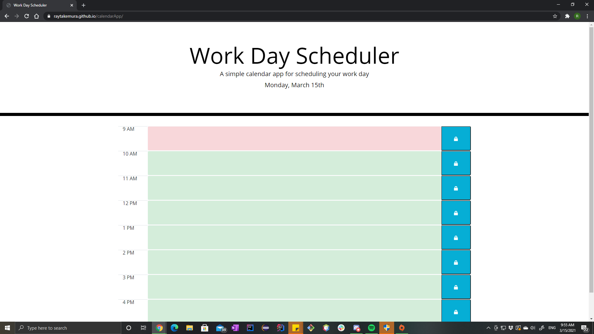
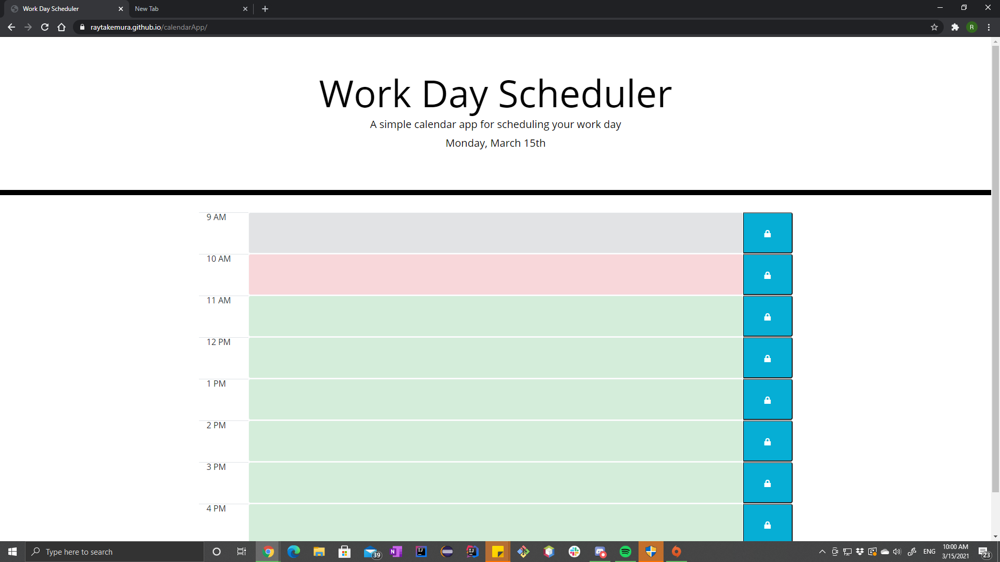
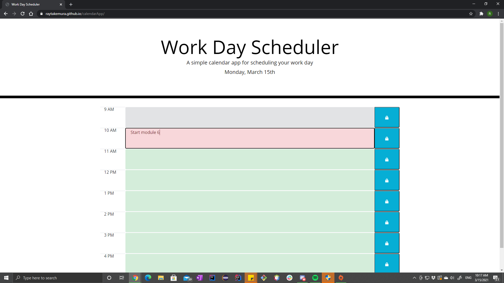

# Work Day Scheduler Starter Code

## Purpose
Create a website that lets users input their daily schedule.
The user can see the upcoming, current, and past schedules per hour.

## Demo

## Built With
* HTML
* CSS
* JavaScript
* Third party API (Bootstrap, jQuery, jQuery moment)

## Website
https://raytakemura.github.io/calendarApp/

## Contribution
Ray Takemura

&copy; Ray Takemura
